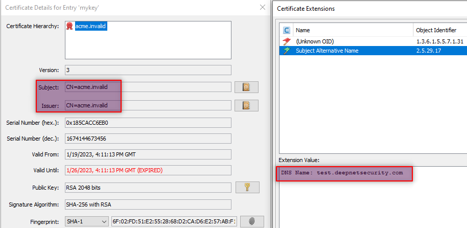

### Jale (Java LetsEncrypt demo client)

We tried to utilize the existing http server hosted on Tomcat Connector to answer the [tls-alpn-01](https://tools.ietf.org/html/rfc8737) challenge sent from LetsEncrypt server.

Tomcat documentation only mentions `ALPN` in the upgrade to HTTP/2 Support. Please note here Tomcat uses ALPN Next protocol *h2*.  We don't know how to add *acme-tls/1* in the **Connector** configuration.

I also noticed Tomcat has a method `setApplicationProtocols` in the class [Jre19Compat](https://tomcat.apache.org/tomcat-8.5-doc/api/org/apache/tomcat/util/compat/Jre19Compat.html), but I could not figure out how to pass the parameters.

[Acme4j](https://github.com/shred/acme4j) has a [client demo sample](https://github.com/shred/acme4j/blob/master/acme4j-example/src/main/java/org/shredzone/acme4j/example/ClientTest.java), but it doesn't have the `tls-alpn-01` challenge at the moment. This is why this project came into existence.

### How to test

LetsEncrypt server (production and staging server) has a requirement that the certificate applicant(requestor) needs to have a public IP and port 443 available, which is inconvenient for the development.

Is there any offline server which can simulate the flow of LetsEncrypt server? Luckily there are a few,

- [Acme2certifier](https://github.com/grindsa/acme2certifier)
- [Boulder](https://github.com/letsencrypt/boulder)
- [Pebble](https://github.com/letsencrypt/pebble)

As a matter of fact, [Acme4j](https://github.com/shred/acme4j) recommends using [Pebble](https://github.com/letsencrypt/pebble). By default Pebble connects back to the requestor on the port 5001  (see `tlsPort` in `.\test\config\pebble-config.json`), so it doesn't matter if the port 443 is used by other process on your machine. That sounds perfect, so I decided to give it a go.

Use `git clone` [Pebble](https://github.com/letsencrypt/pebble) to the local drive. Also download the binary to the folder(In my test, D:\research\pebble). I was just too lazy to install and configure Go environment.

Then simply run the following command,

`D:\research\pebble>pebble_windows-amd64.exe .\test\config\pebble-config.json`

You should see the output like,
```
Pebble 2023/01/27 10:00:33 Starting Pebble ACME server
Pebble 2023/01/27 10:00:34 Generated new root issuer CN=Pebble Root CA 4ae86a with serial 5ee8fa9cce1525bb and SKI cb7ef156c9b425153665d23c7010c0e83f9c0c38
Pebble 2023/01/27 10:00:34 Generated new intermediate issuer CN=Pebble Intermediate CA 60ca14 with serial 2d5dbef668c97ad9 and SKI 308f06f6ee29f9b78d434edeaa6c2e4bcbc461ed
Pebble 2023/01/27 10:00:34 Generated issuance chain: Pebble Root CA 4ae86a -> Pebble Intermediate CA 60ca14
Pebble 2023/01/27 10:00:34 Using system DNS resolver for ACME challenges
Pebble 2023/01/27 10:00:34 Configured to reject 5% of good nonces
Pebble 2023/01/27 10:00:34 Configured to attempt authz reuse for each identifier 50% of the time
Pebble 2023/01/27 10:00:34 Configured to show 3 orders per page
Pebble 2023/01/27 10:00:34 Management interface listening on: 0.0.0.0:15000
Pebble 2023/01/27 10:00:34 Root CA certificate available at: https://0.0.0.0:15000/roots/0
Pebble 2023/01/27 10:00:34 Listening on: 0.0.0.0:14000
Pebble 2023/01/27 10:00:34 ACME directory available at: https://0.0.0.0:14000/dir
```

Accessing https://localhost:14000/dir in browser will return a json object,

```
{
   "keyChange": "https://localhost:14000/rollover-account-key",
   "meta": {
      "externalAccountRequired": false,
      "termsOfService": "data:text/plain,Do%20what%20thou%20wilt"
   },
   "newAccount": "https://localhost:14000/sign-me-up",
   "newNonce": "https://localhost:14000/nonce-plz",
   "newOrder": "https://localhost:14000/order-plz",
   "revokeCert": "https://localhost:14000/revoke-cert"
}
```

If you run `Jale` now, you will hit a problem of server certificate trust .

At Pebble side you should see similar thing like,

> http: TLS handshake error from [::1]:52425: remote error: tls: unknown certificate

[Pebble](https://github.com/letsencrypt/pebble#avoiding-client-https-errors) mentioned,

> "Since the Pebble test CA isn't part of any default CA trust stores you must add the test/certs/pebble.minica.pem certificate to your client's trusted root configuration to avoid HTTPS errors. Your client should offer a runtime option to specify a list of trusted root CAs."

In order to trust Pebble's server certificate, you can follow my instruction if you are using IntelliJ IDE.

Get the file `cacarts` from the JDK (e.g. `C:\Program Files\Java\jdk1.8.0_351\jre\lib\security`), then use [KeyStore Explorer](https://keystore-explorer.org/) to import that *minica*, through **Tools | Import Trusted Certificate**.


Then use this modifed `cacerts` in VM options of IntelliJ project.

`-Djavax.net.ssl.trustStore=D:\work\Jale\cacerts -Djavax.net.ssl.trustStorePassword=changeit`


See the details in https://intellij-support.jetbrains.com/hc/en-us/community/posts/115000080810-Setting-Truststore-

Run `Jale` now, you should see the following at Pebble side. (If everything is right, 😂)

```
Pebble 2023/01/27 10:01:01 GET /dir -> calling handler()
Pebble 2023/01/27 10:01:05 GET /dir -> calling handler()
Pebble 2023/01/27 10:01:05 GET /dir -> calling handler()
Pebble 2023/01/27 10:01:05 HEAD /nonce-plz -> calling handler()
Pebble 2023/01/27 10:01:05 POST /sign-me-up -> calling handler()
Pebble 2023/01/27 10:01:05 There are now 1 accounts in memory
Pebble 2023/01/27 10:01:05 GET /dir -> calling handler()
Pebble 2023/01/27 10:01:05 POST /order-plz -> calling handler()
Pebble 2023/01/27 10:01:05 There are now 1 authorizations in the db
Pebble 2023/01/27 10:01:05 Added order "327PEk2F37lvCkNvOA4Un8zs7HYuAxc_D5AxHMGQNnY" to the db
Pebble 2023/01/27 10:01:05 There are now 1 orders in the db
Pebble 2023/01/27 10:01:05 POST /authZ/ -> calling handler()
Pebble 2023/01/27 10:01:10 POST /chalZ/ -> calling handler()
Pebble 2023/01/27 10:01:10 Pulled a task from the Tasks queue: &va.vaTask{Identifier:acme.Identifier{Type:"dns", Value:"test.bletchley19.com"}, Challenge:(*core.Challenge)(0xc00044e280), Account:(*core.Account)(0xc00005e540)}
Pebble 2023/01/27 10:01:10 Starting 3 validations.
Pebble 2023/01/27 10:01:10 Sleeping for 3s seconds before validating
Pebble 2023/01/27 10:01:10 Sleeping for 1s seconds before validating
Pebble 2023/01/27 10:01:10 Sleeping for 1s seconds before validating
Pebble 2023/01/27 10:01:12 POST /chalZ/ -> calling handler()
Pebble 2023/01/27 10:01:13 authz kc5iqVtKOph476Ipy2ZRiuxmA5djgFJgy_MzV_Rah8c set VALID by completed challenge s0a3RErpH0_ZSqyzqbSCqjUmlcLdv6T_BV8aaIDa-jg
Pebble 2023/01/27 10:01:14 POST /chalZ/ -> calling handler()
Pebble 2023/01/27 10:01:14 POST /finalize-order/ -> calling handler()
Pebble 2023/01/27 10:01:14 Order 327PEk2F37lvCkNvOA4Un8zs7HYuAxc_D5AxHMGQNnY is fully authorized. Processing finalization
Pebble 2023/01/27 10:01:14 Issued certificate serial 5cad30dbdf21d304 for order 327PEk2F37lvCkNvOA4Un8zs7HYuAxc_D5AxHMGQNnY
Pebble 2023/01/27 10:01:14 POST /my-order/ -> calling handler()
Pebble 2023/01/27 10:01:21 POST /certZ/ -> calling handler()
```

### Something you may be interested in

- What the certificate generated by Acme4j function `CertificateUtils.createTlsAlpn01Certificate` looks like?\

Don't worry about the value (`CN=acme.invalid`) of subject and issuer. Pebble (LetsEncrypt) server only cares about **SAN** extension.

- What ALPN Next protocol looks like?\
Before Pebble was involved, I needed to make sure the mini server could be running with ALPN extension correctly.\
This was done in the method `startSSLServer` with a PFX certificate, which I still keep the code.\
For your convenience, I included the file `./assets/alpn.pcapng`. You can view it with WireShark (at that time I used 8443 as the listening port).
I used openssl as the SSL client,  
`
openssl s_client -connect  192.168.0.3:8443 -alpn acme-tls/1 -servername test.bletchley19.com -msg -showcerts
`


- Test domain name.\
As you can see I used the domain `test.bletchley19.com` which is not a public one.\
For the simplicity, I just added a record into Windows `hosts` file (*C:\Windows\System32\drivers\etc\hosts*), not using DNS server at all.\
`192.168.0.3	test.bletchley19.com`\
Pepple was just happy to contact back on this IP, which was resolved by the `hosts` file.

### References

[Root certificates generation using ACME server Pebble](https://blog.xoxzo.com/2020/11/18/root-certificates-generation-using-acme-server-pebble/)\
[Java Secure Socket Extension (JSSE) Reference Guide](https://docs.oracle.com/en/java/javase/11/security/java-secure-socket-extension-jsse-reference-guide.html#GUID-93DEEE16-0B70-40E5-BBE7-55C3FD432345)\
[What is ALPN?](https://docs.oracle.com/javase/8/docs/technotes/guides/security/jsse/alpn.html)

### License
[](https://opensource.org/licenses/MIT)